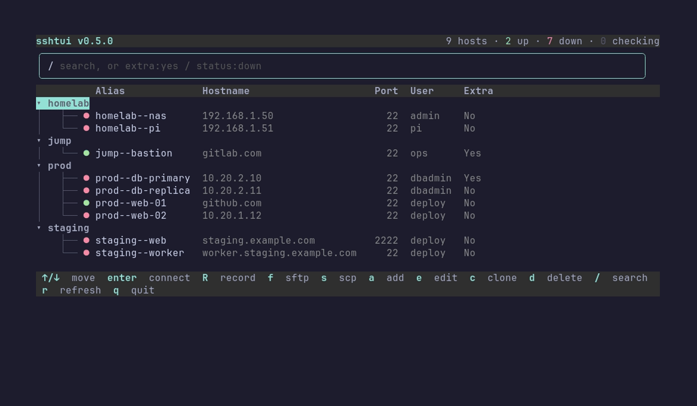

# sshtui

A terminal UI for browsing, connecting to, and editing hosts in
`~/.ssh/config`. Originally written in Python, rewritten in Go with [Bubble Tea](https://github.com/charmbracelet/bubbletea),
[Bubbles](https://github.com/charmbracelet/bubbles), and
[Lip Gloss](https://github.com/charmbracelet/lipgloss).

Instead of hand-editing `~/.ssh/config` and running `ssh <alias>` from
memory, `sshtui` gives you an easy to use, live, grouped, searchable list of your hosts
with one-key connect. Where you can add, edit, and delete, while leaving the rest of
your file (comments, spacing, quirky formatting) untouched.



## Features

- **Grouped, searchable host list** — hosts nest by `--` in their alias
  (`srv--nas--x` → group `srv` > subgroup `nas` > host `x`), with a live
  reachability dot per host and mouse or keyboard navigation.
- **Connect, record, sftp, scp** — `ssh` to a host directly, optionally
  logging the session to a file, drop into an `sftp` prompt, or copy a file
  in either direction with a real file picker.
- **Add / edit / clone / delete hosts** — a form with dedicated
  Hostname/User/Port fields, a scrollable list of any other `ssh_config`
  directive, and a searchable picker for common directive names.
- **Non-intrusive edits** — comments, formatting, and untouched directives
  are preserved exactly on save; only what you actually change gets
  rewritten.
- **Automatic backup** — snapshots `~/.ssh/config` before the first write
  in any run, saved to `$XDG_CONFIG_HOME/sshtui/backups/` (defaults to
  `~/.config/sshtui/backups/`).
- **Mouse support** — click a row to select it, double-click a host to
  connect, click a group to expand/collapse, scroll to move the list.
- **Single static binary** — no runtime dependencies.

## Requirements

- Go 1.24.2+ to build from source (nothing extra needed to just run the
  binary once built)
- macOS or Linux (anywhere `ssh`/`sftp`/`scp` and a terminal are available)

## Installation

From the root directory of this repo, pick one of the following:

- **Build, then place it on your `PATH` yourself:**

  ```sh
  go build -o sshtui ./cmd/sshtui
  ```

  Then put the resulting `sshtui` binary somewhere on your `PATH` (e.g.
  `~/.local/bin/`).

- **Or, install it directly into your Go bin directory:**

  ```sh
  go install ./cmd/sshtui
  ```

### Updating

Pull new code, rebuild, replace the binary.

### Uninstalling

Delete the binary from wherever you put it.

## Usage

Run `sshtui` from any shell. By default it reads and writes
`~/.ssh/config`; use `--config` to point it at a different file instead:

```sh
sshtui --config ~/.ssh/config.work
```

| Key | Action |
|---|---|
| `↑`/`k`, `↓`/`j` | Move selection |
| `Enter` / `Space` | Connect via `ssh` (on a host) or expand/collapse (on a group) |
| `R` | Connect and record the session (see [Recording a session](#recording-a-session)) |
| `f` | Drop into an `sftp` prompt on the selected host |
| `s` | Copy a file to/from the selected host via `scp` |
| `a` | Add a new host |
| `e` | Edit the selected host |
| `c` | Clone the selected host into a new one |
| `d` | Delete the selected host (asks for confirmation) |
| `r` | Refresh reachability checks for all hosts |
| `/` | Focus the search box |
| `Escape` | Clear the search filter and return focus to the list |
| `q` / `Ctrl+C` | Quit |

Click a row to select it, double-click a host to connect, click a group to
expand/collapse it, or scroll the wheel to move the selection.

### Searching

Press `/` to focus the search box, then type to filter the list live:

- Plain text matches against alias, hostname, user, and port.
- `extra:yes` or `extra:no` matches hosts by whether they have any directives
  beyond Hostname/User/Port.
- `status:up`, `status:down`, or `status:unknown` matches by live
  reachability (`reachable`/`unreachable`/`checking` also work).

Press `Enter` to jump back into the filtered list, or `Esc` to clear the
filter and return to the full list.

### Adding or editing a host

Press `a` to add a new host, or `e` to edit the one currently selected.
Move between fields with `Tab`/`Shift+Tab` or `↑`/`↓`:

1. Fill in the **alias** (required) and any of **Hostname**/**User**/**Port**
   you need, leave a field blank to omit that directive entirely. An empty
   **Port** defaults to `22`.
2. To add anything else (`ProxyJump`, `IdentityFile`, and so on), tab to the
   **`+ Add parameter`** button and press `Enter`. A new row appears with a
   directive-name field, a value field, and a **`✕`** button to remove it
   again.
3. On the directive-name field, press `Enter` to search a list of common
   directive names, or just type your own, either way works the same.
   Fill in the value field next to it.
4. When you're done, tab to **Save** and press `Enter`, or **Cancel** to
   discard your changes. `Esc` also cancels from anywhere in the form.

### Copying a file

Select a host and press `s` to open the copy form. Move between fields and
buttons with `Tab`/`Shift+Tab` or `↑`/`↓`:

1. Fill in the **local path** yourself, or tab to **`Browse...`** and press
   `Enter` to pick one with a real file picker, it can navigate both up
   and down freely, not just downward from where it starts.
2. Fill in the **remote path**.
3. Tab to **`Upload →`** and press `Enter` to send the local file to the
   host, or **`← Download`** to pull the remote file down. **Cancel** (or
   `Esc` from anywhere in the form) backs out without copying anything.

### Recording a session

Select a host and press `R` to connect via `ssh` while logging the entire
terminal session (everything printed to your screen, not just what you
type) to a file. Under the hood, `sshtui` execs the `script` command
wrapped around `ssh <alias>` — `script -q <path> ssh <alias>` on
macOS/BSD, `script -q -c "ssh <alias>" <path>` on Linux — so recording
starts the moment the connection opens and ends when you disconnect.

The log is written to `~/Documents/sshtui/<alias>-<timestamp>.log`, where
`<timestamp>` reflects the moment recording starts (format
`YYYYMMDDTHHMMSS`, e.g. `myhost-20260919T143012.log`). The `~/Documents/sshtui/`
directory is created automatically if it doesn't already exist.

### Reconnecting with the up arrow

Since `sshtui` execs `ssh`/`sftp`/`scp` directly, your shell history only
ever shows "ran `sshtui`", so the up arrow just reopens the picker instead
of recalling the actual command. To make it recall the real command
instead, add this to your shell rc file and reload your shell:

```sh
# ~/.zshrc
eval "$(sshtui --shell-init zsh)"
```

```sh
# ~/.bashrc
eval "$(sshtui --shell-init bash)"
```

No file to find or path to hardcode — the shell integration is built into
the binary itself. This defines a shell function named `sshtui` that
shadows the installed binary for interactive use: it runs `sshtui
--print-only`, then runs the real `ssh`/`sftp`/`scp` command itself
afterward, recording it in your shell history. Use `command sshtui` to
bypass it if you need the plain installed command directly.

## Data files

| Path | Purpose |
|---|---|
| `~/.ssh/config` | The source of truth. Read on every screen refresh, written on every save. |
| `$XDG_CONFIG_HOME/sshtui/history.json` | `{alias: {count, last_used}}` (defaults to `~/.config/sshtui/history.json`). |
| `$XDG_CONFIG_HOME/sshtui/backups/config-<timestamp>` | Snapshot of `~/.ssh/config` taken before the first write each run (defaults to `~/.config/sshtui/backups/`). See [Automatic backup](#features). |
| `~/Documents/sshtui/<alias>-<timestamp>.log` | Recorded session logs (from `R`). See [Recording a session](#recording-a-session). |

## Known limitations

- **Doesn't follow `Include` directives** — only one file is read and
  written per run, so hosts pulled in via `Include` aren't visible unless
  you point `--config` directly at that file instead.
- **Grouping is alias-based** — grouping is purely a string convention
  (every `--`-separated segment of the alias becomes a nesting level), not
  a configurable taxonomy.
- **No Windows support** — relies on `syscall.Exec` and POSIX terminal
  semantics.

## License

[MIT](LICENSE)
